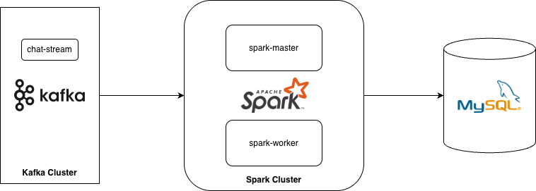
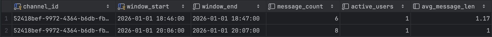
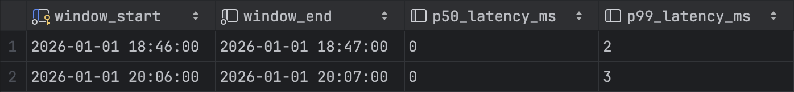
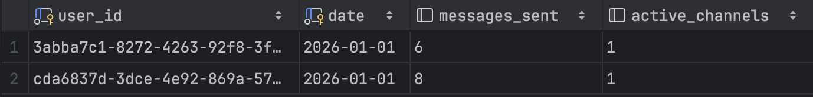
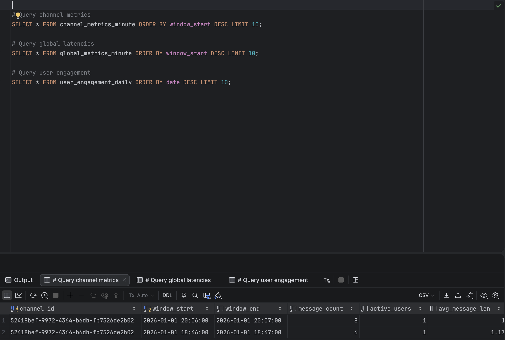
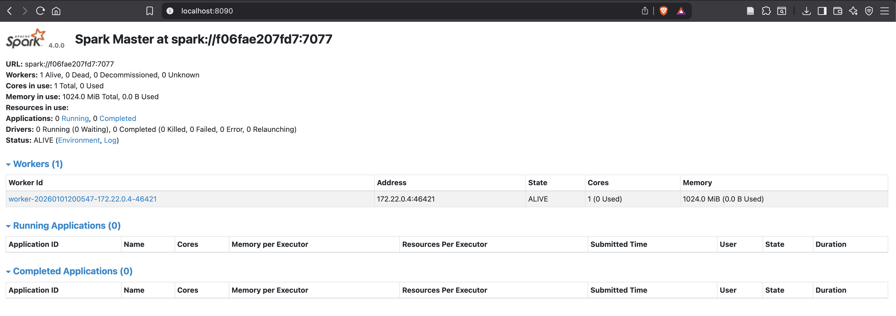

# Chat Analytics Service

A real-time analytics engine for the distributed chat application, built with Apache Spark Structured Streaming. This service processes chat messages from Kafka streams and computes various metrics including channel activity, global latencies, and user engagement patterns.



## Table of Contents

- [Overview](#overview)
- [Architecture](#architecture)
  - [System Components](#system-components)
  - [Technology Stack](#technology-stack)
  - [Data Flow](#data-flow)
- [Analytics Metrics](#analytics-metrics)
- [Prerequisites](#prerequisites)
- [Getting Started](#getting-started)
  - [1. Setup Infrastructure](#1-setup-infrastructure)
  - [2. Build the Application](#2-build-the-application)
  - [3. Start Analytics Services](#3-start-analytics-services)
- [Project Structure](#project-structure)
- [Configuration](#configuration)
- [Development](#development)
- [Monitoring](#monitoring)

---

## Overview

The Chat Analytics service is a streaming analytics engine that processes chat messages in real-time using Apache Spark Structured Streaming. It consumes message events from Kafka, computes aggregated metrics using windowed operations, and persists the results to MySQL for visualization and reporting.

### Key Features

- 🔥 **Real-time stream processing** with Apache Spark Structured Streaming
- 📊 **Windowed aggregations** for time-series metrics (1-minute windows)
- 📈 **Multiple metric types**: channel activity, global latencies, user engagement
- 💾 **Persistent storage** in MySQL database
- 🎯 **Distributed processing** with Spark master-worker architecture
- 🔄 **Protobuf deserialization** for efficient message parsing
- 📉 **Percentile calculations** (p50, p99) for latency analysis
- 🐳 **Containerized deployment** with Docker Compose

---

## Architecture

### System Components

The analytics service consists of three main components:

#### 1. **Spark Streaming Application** (`src/main/scala/`)
- Consumes chat messages from Kafka topics
- Performs windowed aggregations and metric calculations
- Deserializes Protobuf messages using descriptor files
- Coordinates data processing across workers

#### 2. **Persistence Layer** (`src/main/scala/com/example/chat/analytics/dbpersistence/`)
- Writes computed metrics to MySQL database
- Handles batch inserts with UPSERT logic
- Manages database connections and transactions

#### 3. **Infrastructure**
- **Apache Spark Cluster**: Master (port 7077) + Worker nodes
- **MySQL Database**: Stores analytics results (port 3306)
- **Kafka**: Message source (consumed from [main chat infrastructure](https://github.com/KoustubhAnturkar/chat-app))

### Technology Stack

| Component | Technologies |
|-----------|-------------|
| **Stream Processing** | Apache Spark 4.0.0, Spark Structured Streaming |
| **Language** | Scala 2.13.10 |
| **Message Queue** | Kafka (with Spark-Kafka integration) |
| **Database** | MySQL 8+ |
| **Serialization** | Protocol Buffers (Protobuf) |
| **Build Tool** | SBT (Scala Build Tool) |
| **Containerization** | Docker & Docker Compose |
| **Configuration** | Typesafe Config (HOCON) |

### Data Flow

```
1. Chat messages published to Kafka topic "chat-stream"
2. Spark Streaming application consumes from Kafka
3. Messages deserialized from Protobuf format
4. Windowed aggregations computed (1-minute tumbling windows)
5. Metrics written to MySQL via foreachBatch sink
6. Results available for querying and visualization
```

---

## Analytics Metrics

The service computes three types of real-time metrics:

### 1. **Channel Metrics** (1-minute windows)

Tracks activity per channel with the following metrics:
- **Message Count**: Total messages sent in the window
- **Active Users**: Number of unique users who sent messages
- **Average Message Length**: Mean character count of messages

**Table**: `channel_metrics_minute`

### 2. **Global Latency Metrics** (1-minute windows)

Measures end-to-end message delivery latency:
- **P50 Latency**: Median message delay (milliseconds)
- **P99 Latency**: 99th percentile message delay (milliseconds)

**Table**: `global_metrics_minute`

### 3. **User Engagement Metrics** (daily aggregations)

Tracks user activity patterns:
- **Messages Sent**: Total messages per user per day
- **Active Channels**: Number of distinct channels the user participated in

**Table**: `channel_metrics_minute`


**Table**: `global_metrics_minute`


**Table**: `user_engagement_daily`


---

## Prerequisites

Before running the analytics service, ensure you have:

- **Java Development Kit (JDK) 11+**
  ```bash
  java -version
  ```

- **Scala 2.13.x** (managed by SBT)

- **SBT (Scala Build Tool) 1.x**
  ```bash
  sbt --version
  ```

- **Docker and Docker Compose**
  ```bash
  docker --version
  docker-compose --version
  ```

- **Apache Kafka** (running and accessible)
  - Must be the same Kafka cluster used by the main chat backend
  - Default: `localhost:29092` (or configured bootstrap servers)

- **Protobuf Descriptor Files**
  - Generated from the `proto/` directory in the main project

---

## Getting Started

### 1. Setup Infrastructure

#### Start MySQL Database

The analytics service uses MySQL to store computed metrics.

```bash
# Navigate to chat-analytics directory
cd chat-analytics

# Start MySQL container
docker-compose up -d db

# Verify database is running
docker ps | grep mysql
```

The database schema is automatically initialized from `schema/*.sql` files.

#### Verify Kafka is Running

Ensure the main chat application's Kafka cluster is running:

```bash
# Check Kafka brokers (from main project directory)
docker ps | grep kafka
```

### 2. Build the Application

#### Generate Protobuf Descriptor Files

```bash
# Navigate to the proto directory (main project)
cd ../proto

# Generate descriptor file
protoc --descriptor_set_out=desc/chat_all.desc \
  --include_imports \
  chat-message.proto \
  user-updates.proto \
  channel-updates.proto \
  common.proto
```

#### Build the Spark Application JAR

```bash
# Navigate back to chat-analytics
cd ../chat-analytics

# Compile and package application
sbt clean assembly

# Verify JAR is created
ls -lh target/scala-2.13/chat-analytics-assembly-1.0.0-SNAPSHOT.jar
```

The assembled JAR includes all dependencies and will be ~300-400 MB.

### 3. Start Analytics Services

#### Start Spark Cluster

```bash
# Start Spark master and worker
docker-compose up -d spark spark-worker

# Check Spark UI (optional)
open http://localhost:8090
```

#### Submit Spark Streaming Job

```bash
# Submit the application to Spark cluster
docker exec -it -u spark chat-analytics-spark-1 \
  spark-submit --class com.example.chat.QueueStream \
  --packages org.apache.spark:spark-sql-kafka-0-10_2.13:4.0.0,mysql:mysql-connector-java:8.0.33\
  --conf spark.jars.ivy=/opt/bitnami/spark/ivy \
  --conf spark.hadoop.hadoop.security.authentication=simple \
  --conf spark.hadoop.fs.defaultFS=file:/// \
  ivy/chat-analytics-assembly-1.0.0-SNAPSHOT.jar
```

Alternatively, you can start the job in the background:
  
```bash
docker exec -d -u spark chat-analytics-spark-1 \
  spark-submit --class com.example.chat.QueueStream \
  --packages org.apache.spark:spark-sql-kafka-0-10_2.13:4.0.0,mysql:mysql-connector-java:8.0.33\
  --conf spark.jars.ivy=/opt/bitnami/spark/ivy \
  --conf spark.hadoop.hadoop.security.authentication=simple \
  --conf spark.hadoop.fs.defaultFS=file:/// \
  ivy/chat-analytics-assembly-1.0.0-SNAPSHOT.jar
```

#### Query Metrics from Database

```bash
# Connect to MySQL
docker exec -it $(docker ps -qf "name=chat-analytics-db") \
  mysql -uroot -pchatanalytics chatanalytics

# Query channel metrics
SELECT * FROM channel_metrics_minute ORDER BY window_start DESC LIMIT 10;

# Query global latencies
SELECT * FROM global_metrics_minute ORDER BY window_start DESC LIMIT 10;

# Query user engagement
SELECT * FROM user_engagement_daily ORDER BY date DESC LIMIT 10;

# Exit MySQL
exit
```



---

## Project Structure

```
chat-analytics/
├── build.sbt                      # SBT build configuration
├── docker-compose.yaml            # Docker services definition
├── Dockerfile.spark               # Custom Spark image
│
├── schema/                        # MySQL schema definitions
│   ├── channel_metrics_minute.sql
│   ├── global_metrics_minute.sql
│   └── user_engagement_daily.sql
│
├── src/
│   └── main/
│       ├── scala/
│       │   └── com/example/chat/
│       │       ├── QueueStream.scala              # Main streaming application
│       │       └── analytics/
│       │           └── dbpersistence/
│       │               └── PersistAnalytics.scala # Database persistence layer
│       └── resources/
│           └── application.conf                    # Application configuration
│
├── target/                        # Build output directory
│   └── scala-2.13/
│       └── chat-analytics-assembly-1.0.0-SNAPSHOT.jar
│
├── jars_dir/                      # Spark dependencies cache
└── project/                       # SBT project metadata
    ├── build.properties
    └── plugins.sbt
```

---

## Configuration

### Application Configuration

Edit `src/main/resources/application.conf`:

```hocon
kafka {
  bootstrap.servers = "host.docker.internal:29092"
}

spark {
  master = "spark://chat-analytics-spark-1:7077"
  app.name = "ChatAnalyticsStream"
}

proto {
  descriptor.path = "/var/lib/proto/desc/chat_all.desc"
}

kafka.stream {
  subscribe = "chat-stream"
  starting.offsets = "earliest"
  max.poll.interval.ms = "5000"
}

jdbc {
  url = "jdbc:mysql://host.docker.internal:3306/chatanalytics"
  user = "root"
  password = "chatanalytics"
  driver = "com.mysql.cj.jdbc.Driver"
}
```

### Docker Compose Configuration

Key environment variables in `docker-compose.yaml`:

```yaml
services:
  db:
    environment:
      MYSQL_ROOT_PASSWORD: chatanalytics
      MYSQL_DATABASE: chatanalytics
    ports:
      - "3306:3306"

  spark:
    environment:
      - SPARK_MODE=master
    ports:
      - '8090:8080'  # Spark UI
      - '7077:7077'  # Spark master

  spark-worker:
    environment:
      - SPARK_MODE=worker
      - SPARK_MASTER_URL=spark://chat-analytics-spark-1:7077
      - SPARK_WORKER_MEMORY=1G
      - SPARK_WORKER_CORES=1
```

---

## Development

### Building the Project

```bash
# Clean and compile
sbt clean compile

# Create assembly JAR
sbt assembly
```

### Regenerating Protobuf Classes

```bash
# Assuming chat-app has been cloned in the parent directory

cd ../proto
protoc --include_imports \
  --descriptor_set_out=desc/chat_all.desc \
  chat-message.proto channel-updates.proto common.proto user-updates.proto
```

---

## Monitoring

### Spark Web UI

Access the Spark UI to monitor job progress:

```
http://localhost:8090
```

**Available Information**:
- Active jobs and stages
- Executor status and resource usage
- Streaming statistics and batch timings
- Event timeline and DAG visualization




### Database Metrics

```sql
-- Check data freshness
SELECT 
  MAX(window_start) as latest_window,
  COUNT(*) as total_records
FROM channel_metrics_minute;

-- Channel activity over last hour
SELECT 
  channel_id,
  SUM(message_count) as total_messages,
  AVG(active_users) as avg_users
FROM channel_metrics_minute
WHERE window_start >= DATE_SUB(NOW(), INTERVAL 1 HOUR)
GROUP BY channel_id;

-- Global latency trends
SELECT 
  window_start,
  p50_latency_ms,
  p99_latency_ms
FROM global_metrics_minute
ORDER BY window_start DESC
LIMIT 20;
```
---

**Built with ❤️ for real-time analytics**

